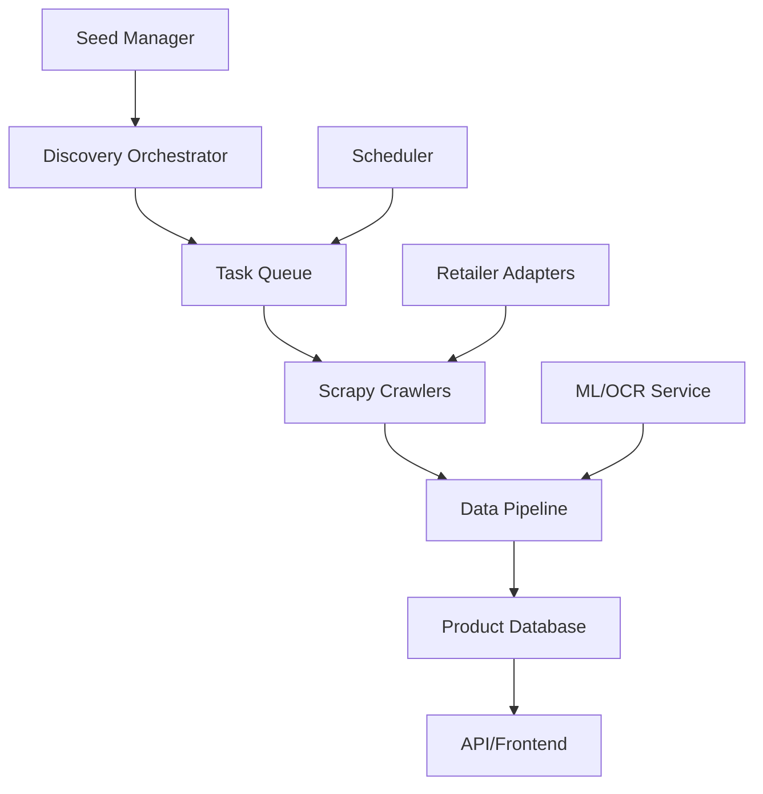

# LabelSquor Crawler Architecture

## Overview

A unified, scalable system for discovering and analyzing food products across Indian e-commerce platforms.



## Core Principles

1. **Unified Taxonomy**: One internal category system, mapped to each retailer
2. **Retailer Agnostic**: Search terms and categories work across all platforms
3. **Cloud-First**: No local crawling, everything runs in cloud
4. **Incremental**: Discover new, update existing, track changes
5. **Quality-First**: Deduplication, validation, confidence scoring

## 1. Unified Product Taxonomy

### Internal Categories (Our Truth)
```
Food & Beverages/
├── Snacks/
│   ├── Chips & Crisps
│   ├── Namkeen & Mixtures
│   ├── Nuts & Dried Fruits
│   └── Popcorn
├── Beverages/
│   ├── Carbonated Drinks
│   ├── Juices
│   ├── Energy Drinks
│   └── Water
├── Dairy/
│   ├── Milk
│   ├── Curd & Yogurt
│   ├── Cheese & Paneer
│   └── Butter & Cream
├── Instant Foods/
│   ├── Noodles
│   ├── Pasta
│   ├── Ready-to-Eat
│   └── Soups
└── Staples/
    ├── Atta & Flours
    ├── Rice
    ├── Pulses
    └── Cooking Oils
```

### Retailer Mappings
```python
CATEGORY_MAPPINGS = {
    "Snacks/Chips & Crisps": {
        "bigbasket": "/pc/snacks-branded-foods/chips-crisps/",
        "blinkit": "/c/chips-crisps-nachos/",
        "zepto": "/categories/chips-wafers",
        "amazon": "/s?k=chips&i=grocery"
    }
}
```

## 2. Seed Management System

### Universal Search Terms
```python
UNIVERSAL_SEEDS = {
    "brands": {
        "tier1": ["maggi", "lays", "britannia", "amul", "parle"],
        "tier2": ["haldiram", "cadbury", "nestle", "dabur"],
        "tier3": ["mtr", "everest", "patanjali", "tata"]
    },
    "products": {
        "popular": ["noodles", "chips", "biscuits", "chocolate"],
        "health": ["oats", "muesli", "protein", "sugar free"],
        "traditional": ["atta", "dal", "ghee", "masala"]
    }
}
```

## 3. Discovery Pipeline

### 3.1 Discovery Orchestrator
```python
class DiscoveryOrchestrator:
    """Manages product discovery across all retailers"""
    
    def __init__(self):
        self.retailers = ["bigbasket", "blinkit", "zepto", "amazon"]
        self.strategies = ["sitemap", "search", "category", "trending"]
    
    def plan_discovery(self):
        """Generate discovery tasks for all retailers"""
        tasks = []
        
        # 1. Daily: Search high-priority terms
        for retailer in self.retailers:
            for term in self.get_priority_terms():
                tasks.append({
                    "retailer": retailer,
                    "strategy": "search",
                    "target": term,
                    "priority": 9
                })
        
        # 2. Weekly: Browse categories
        for category in self.get_categories():
            for retailer in self.retailers:
                if mapping := self.get_retailer_mapping(category, retailer):
                    tasks.append({
                        "retailer": retailer,
                        "strategy": "category",
                        "target": mapping,
                        "priority": 7
                    })
        
        # 3. Daily: Check trending/new
        for retailer in self.retailers:
            tasks.append({
                "retailer": retailer,
                "strategy": "trending",
                "priority": 8
            })
        
        return tasks
```

### 3.2 Task Queue
```sql
-- Discovery tasks table
CREATE TABLE discovery_task (
    id SERIAL PRIMARY KEY,
    retailer VARCHAR(50) NOT NULL,
    strategy VARCHAR(50) NOT NULL,  -- search, category, sitemap, trending
    target VARCHAR(500),             -- search term, category path, etc.
    priority INTEGER DEFAULT 5,
    
    -- Scheduling
    scheduled_at TIMESTAMP,
    expires_at TIMESTAMP,
    
    -- Execution
    status VARCHAR(50) DEFAULT 'pending',
    started_at TIMESTAMP,
    completed_at TIMESTAMP,
    
    -- Results
    urls_found INTEGER DEFAULT 0,
    new_products INTEGER DEFAULT 0,
    error_message TEXT,
    
    -- Metadata
    metadata JSONB DEFAULT '{}',
    created_at TIMESTAMP DEFAULT NOW()
);

-- Discovered URLs ready for crawling
CREATE TABLE crawl_queue (
    id SERIAL PRIMARY KEY,
    url VARCHAR(1000) NOT NULL,
    retailer VARCHAR(50) NOT NULL,
    discovery_method VARCHAR(100),
    priority INTEGER DEFAULT 5,
    
    -- Deduplication
    url_hash VARCHAR(64) UNIQUE,
    
    -- Status
    status VARCHAR(50) DEFAULT 'pending',
    attempts INTEGER DEFAULT 0,
    last_attempt TIMESTAMP,
    
    -- Results
    crawled_at TIMESTAMP,
    product_id UUID,
    
    created_at TIMESTAMP DEFAULT NOW()
);
```

## 4. Retailer Adapters

### Base Adapter Pattern
```python
class RetailerAdapter(ABC):
    """Base class for retailer-specific logic"""
    
    @abstractmethod
    def get_search_url(self, term: str) -> str:
        """Build search URL for this retailer"""
        pass
    
    @abstractmethod
    def get_category_url(self, category: str, page: int = 1) -> str:
        """Build category URL for this retailer"""
        pass
    
    @abstractmethod
    def extract_product_urls(self, response) -> List[str]:
        """Extract product URLs from response"""
        pass
    
    @abstractmethod
    def extract_product_data(self, response) -> dict:
        """Extract product data from product page"""
        pass

class BigBasketAdapter(RetailerAdapter):
    def get_search_url(self, term: str) -> str:
        return f"https://www.bigbasket.com/ps/?q={term}"
    
    def get_category_url(self, category: str, page: int = 1) -> str:
        return f"https://www.bigbasket.com{category}?page={page}"
    
    def extract_product_urls(self, response) -> List[str]:
        # BigBasket specific selectors
        return response.css('a[qa="product"]::attr(href)').getall()
```

## 5. Crawl Execution

### 5.1 Spider Factory
```python
class UniversalSpider(scrapy.Spider):
    """Single spider that works with all retailers via adapters"""
    name = 'universal'
    
    def __init__(self, retailer=None, task_id=None, *args, **kwargs):
        super().__init__(*args, **kwargs)
        self.retailer = retailer
        self.adapter = RetailerFactory.get_adapter(retailer)
        self.task_id = task_id
    
    def start_requests(self):
        # Get task from queue
        task = self.get_task(self.task_id)
        
        if task['strategy'] == 'search':
            url = self.adapter.get_search_url(task['target'])
        elif task['strategy'] == 'category':
            url = self.adapter.get_category_url(task['target'])
        
        yield scrapy.Request(url, meta={'task': task})
```

### 5.2 Cloud Deployment
```yaml
# GitHub Actions workflow
name: Continuous Discovery

on:
  schedule:
    - cron: '0 */2 * * *'  # Every 2 hours

jobs:
  discover:
    runs-on: ubuntu-latest
    strategy:
      matrix:
        retailer: [bigbasket, blinkit, zepto]
    
    steps:
      - name: Run Discovery
        run: |
          python orchestrator.py discover --retailer ${{ matrix.retailer }}
      
      - name: Process Queue
        run: |
          scrapy crawl universal -a retailer=${{ matrix.retailer }}
```

## 6. Data Pipeline

### 6.1 Processing Flow
```python
class ProductPipeline:
    def process_item(self, item, spider):
        # 1. Normalize data
        normalized = self.normalize_product(item)
        
        # 2. Deduplicate
        existing = self.find_existing_product(normalized)
        if existing:
            return self.update_product(existing, normalized)
        
        # 3. Enrich
        enriched = self.enrich_product(normalized)
        
        # 4. Validate
        if not self.validate_product(enriched):
            raise DropItem("Invalid product data")
        
        # 5. Calculate scores
        enriched['scores'] = self.calculate_scores(enriched)
        
        # 6. Save
        return self.save_product(enriched)
```

### 6.2 Product Matching
```python
class ProductMatcher:
    """Match products across retailers"""
    
    def find_matches(self, product):
        candidates = []
        
        # 1. Exact barcode match
        if product.get('barcode'):
            candidates.extend(self.find_by_barcode(product['barcode']))
        
        # 2. Name + Brand similarity
        similar = self.find_similar_products(
            name=product['name'],
            brand=product['brand'],
            threshold=0.85
        )
        candidates.extend(similar)
        
        # 3. ML-based matching
        if self.ml_matcher:
            ml_matches = self.ml_matcher.predict(product)
            candidates.extend(ml_matches)
        
        return self.rank_candidates(candidates)
```

## 7. Quality Assurance

### 7.1 Data Validation
```python
REQUIRED_FIELDS = {
    'name': str,
    'brand': str,
    'images': list,
    'price': (int, float),
    'retailer': str,
    'url': str
}

QUALITY_CHECKS = [
    'has_ingredient_info',
    'has_nutrition_info',
    'has_multiple_images',
    'price_within_range',
    'valid_fssai_number'
]
```

### 7.2 Monitoring
```python
class CrawlerMonitor:
    def track_metrics(self):
        return {
            "discovery_rate": self.new_products_per_day(),
            "update_rate": self.updated_products_per_day(),
            "coverage": self.category_coverage(),
            "quality_score": self.average_quality_score(),
            "error_rate": self.failed_tasks_percentage()
        }
```

## 8. Implementation Phases

### Phase 1: Foundation (Week 1)
- [ ] Set up unified taxonomy
- [ ] Create retailer adapters for BigBasket, Blinkit
- [ ] Implement basic discovery orchestrator
- [ ] Deploy to GitHub Actions

### Phase 2: Scale (Week 2)
- [ ] Add Zepto, Amazon adapters  
- [ ] Implement product matching
- [ ] Add data quality checks
- [ ] Set up monitoring

### Phase 3: Intelligence (Week 3)
- [ ] ML-based product matching
- [ ] Smart scheduling based on product popularity
- [ ] Automated quality scoring
- [ ] API integration

## 9. Configuration

### Environment Variables
```bash
# Crawler settings
CRAWLER_CONCURRENT_REQUESTS=16
CRAWLER_DOWNLOAD_DELAY=1
CRAWLER_USER_AGENT="LabelSquor Bot"

# Retailers
RETAILER_BIGBASKET_ENABLED=true
RETAILER_BLINKIT_ENABLED=true
RETAILER_ZEPTO_ENABLED=true

# Discovery
DISCOVERY_SEARCH_TERMS_LIMIT=100
DISCOVERY_CATEGORIES_DEPTH=3
DISCOVERY_NEW_PRODUCTS_PRIORITY=9
```

## 10. Success Metrics

1. **Coverage**: 10,000+ unique products within 30 days
2. **Freshness**: Updates within 24 hours of changes
3. **Quality**: 95%+ products with complete information
4. **Efficiency**: < $50/month infrastructure cost
5. **Reliability**: 99%+ uptime for discovery pipeline
