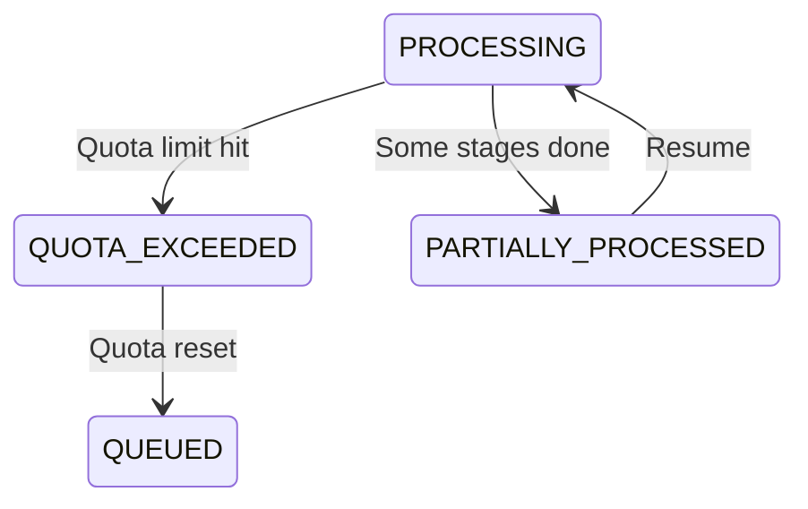

# Quota Management & Token Tracking

## Overview

We've implemented comprehensive quota management to handle Gemini API limits gracefully, track token usage for cost monitoring, and enable partial state recovery when quotas are exceeded.

## 🎯 Key Features

### 1. Real-time Quota Tracking
- **Token limits**: 4M/minute, 1B/day (Gemini free tier)
- **Request limits**: 15/minute, 1,500/day
- **Automatic tracking** of all API calls
- **Cost calculation** in real-time

### 2. Graceful Quota Handling
- **New workflow states**: `QUOTA_EXCEEDED`, `PARTIALLY_PROCESSED`
- **Automatic pause** when quota exceeded
- **Resume from exact point** when quota resets
- **No lost work** - all progress saved

### 3. Partial State Management
- **Save progress** at each stage
- **Track completed stages**
- **Store partial results**
- **Resume efficiently**

## 📊 Workflow States

### New States Added



### State Definitions

- **QUOTA_EXCEEDED**: Workflow paused due to API quota limits
  - Saves current progress
  - Calculates wait time
  - Schedules automatic retry
  
- **PARTIALLY_PROCESSED**: Some stages completed successfully
  - Can resume from last successful stage
  - Partial results available
  - Progress percentage tracked

## 🔧 Implementation Details

### Quota Manager

```python
# Check quota before AI calls
can_proceed, error_msg, status = await quota_manager.check_quota(estimated_tokens=1000)

if not can_proceed:
    # Transition to QUOTA_EXCEEDED state
    # Save progress and wait for reset
```

### Token Tracking

```python
# After successful API call
await quota_manager.record_usage(
    tokens_used=847,
    input_tokens=500,
    output_tokens=347,
    images=3
)

# Cost automatically calculated
# $0.0012 per product (Gemini 2.5 Flash)
```

### Progress Saving

When quota is exceeded:
1. **Save completed stages**
   ```json
   {
     "completed_stages": ["discovery", "image_fetch"],
     "last_stage_attempted": "enrichment",
     "partial_results": {
       "product_id": "uuid",
       "progress_percentage": 40.0
     }
   }
   ```

2. **Calculate wait time**
   - Per-minute quotas: Wait 60 seconds
   - Per-day quotas: Wait until midnight UTC

3. **Schedule retry**
   - Automatic retry when quota resets
   - Manual resume available via API

## 🌐 API Endpoints

### Quota Status

```bash
GET /api/v1/quota/status?service=gemini

Response:
{
  "service": "gemini",
  "quotas": {
    "tokens_per_minute": {
      "used": 3500000,
      "limit": 4000000,
      "remaining": 500000,
      "percentage": 87.5
    },
    "requests_per_day": {
      "used": 1200,
      "limit": 1500,
      "remaining": 300,
      "percentage": 80.0
    }
  },
  "cost_tracking": {
    "total_tokens": 850000,
    "total_requests": 1200,
    "total_cost_usd": 1.44,
    "breakdown": {
      "input_tokens": 500000,
      "output_tokens": 350000,
      "image_count": 3600
    }
  },
  "reset_times": {
    "tokens_per_minute": {
      "reset_at": "2024-01-20T15:32:00Z",
      "seconds_until_reset": 45
    }
  },
  "is_available": true
}
```

### Usage History

```bash
GET /api/v1/quota/usage/history?service=gemini&time_range=24h

Response:
{
  "service": "gemini",
  "time_range": "24h",
  "usage_history": [
    {
      "hour": "2024-01-20T14:00:00Z",
      "requests": 150,
      "total_tokens": 125000,
      "total_cost": 0.18,
      "avg_tokens_per_request": 833.3,
      "quota_exceeded_count": 2
    }
  ],
  "summary": {
    "total_requests": 1200,
    "total_tokens": 850000,
    "total_cost": 1.44,
    "avg_cost_per_request": 0.0012
  }
}
```

### Quota Exceeded Workflows

```bash
GET /api/v1/quota/exceeded/workflows

Response:
{
  "total": 15,
  "workflows": [
    {
      "workflow_id": "uuid",
      "product_name": "Maggi Noodles",
      "brand_name": "Nestle",
      "state": "quota_exceeded",
      "stage": "enrichment",
      "quota_exceeded_count": 1,
      "next_retry_at": "2024-01-20T15:32:00Z",
      "wait_seconds": 180,
      "progress_percentage": 40.0
    }
  ]
}
```

### Resume Workflows

```bash
POST /api/v1/quota/exceeded/resume

Response:
{
  "success": true,
  "resumed_count": 15,
  "message": "Successfully resumed 15 workflows"
}
```

## 📈 Monitoring Dashboard

### Key Metrics

1. **Quota Utilization**
   - Current usage vs limits
   - Time until reset
   - Historical trends

2. **Cost Tracking**
   - Cost per product
   - Daily/weekly/monthly costs
   - Cost breakdown by operation

3. **Workflow Impact**
   - Workflows blocked by quota
   - Average wait times
   - Resume success rate

### Database Views

```sql
-- Current quota status
SELECT * FROM vw_quota_usage_current;

-- Quota exceeded workflows
SELECT * FROM vw_quota_exceeded_workflows;

-- Usage summary
SELECT * FROM get_quota_usage_summary('gemini', '24 hours');

-- Reset time estimates
SELECT * FROM estimate_quota_reset_time('gemini');
```

## 🚀 Usage Patterns

### Optimal Processing

1. **Batch Processing**
   ```python
   # Process in batches to avoid hitting per-minute limits
   batch_size = 10  # ~10K tokens per batch
   ```

2. **Time-based Scheduling**
   ```python
   # Spread processing throughout the day
   # Avoid burst processing that hits minute limits
   ```

3. **Priority Queue**
   ```python
   # Process high-priority items first
   # Queue low-priority for off-peak hours
   ```

### Cost Optimization

1. **Current Costs** (Gemini 2.5 Flash)
   - Per product: $0.0004 - $0.0012
   - Daily (1000 products): $0.40 - $1.20
   - Monthly (30K products): $12 - $36

2. **Optimization Tips**
   - Use minimal mode for basic products
   - Cache results to avoid reprocessing
   - Batch similar products

## 🔍 Troubleshooting

### Common Issues

1. **"Quota exceeded" errors**
   - Check `/api/v1/quota/status`
   - Wait for reset time
   - Or upgrade to paid tier

2. **Workflows stuck in QUOTA_EXCEEDED**
   - Check if quota is actually available
   - Try manual resume via API
   - Check for other errors in logs

3. **Partial results not saving**
   - Ensure stage_details is being updated
   - Check database transaction commits
   - Verify partial_results extraction

### Debug Queries

```sql
-- Find stuck workflows
SELECT * FROM processing_queue 
WHERE workflow_state = 'quota_exceeded' 
AND next_retry_at < NOW();

-- Check quota usage patterns
SELECT 
  DATE_TRUNC('hour', created_at) as hour,
  COUNT(*) as requests,
  SUM((usage_data->'cost_tracking'->>'total_tokens')::INT) as tokens
FROM quota_usage_log
WHERE created_at > NOW() - INTERVAL '24 hours'
GROUP BY hour
ORDER BY hour;

-- Analyze quota exceeded frequency
SELECT 
  DATE(created_at) as day,
  COUNT(*) as quota_exceeded_count,
  AVG(quota_exceeded_count) as avg_per_workflow
FROM processing_queue
WHERE quota_exceeded_count > 0
GROUP BY day;
```

## 🎯 Best Practices

1. **Monitor Quota Usage**
   - Set up alerts at 80% usage
   - Review daily patterns
   - Optimize high-token operations

2. **Handle Quota Gracefully**
   - Always save progress
   - Provide clear feedback
   - Enable manual overrides

3. **Plan for Scale**
   - Estimate costs before bulk operations
   - Consider paid tier for production
   - Implement request queuing

4. **Cost Management**
   - Track cost per product type
   - Identify expensive operations
   - Optimize prompts and image counts

## 🔄 Automatic Recovery

### How It Works

1. **Detection**
   - Quota exceeded during API call
   - Exception caught and handled
   - State transitioned to QUOTA_EXCEEDED

2. **Progress Saved**
   - Current stage marked
   - Partial results stored
   - Wait time calculated

3. **Scheduling**
   - Retry scheduled for quota reset
   - Workflow marked with retry time
   - Worker picks up when ready

4. **Resume**
   - Check quota availability
   - Load saved progress
   - Continue from last stage

### Configuration

```python
# Configure retry behavior
workflow_config = WorkflowConfig(
    max_retries=3,
    retry_backoff_base=60,  # Wait at least 60s
    enable_quota_recovery=True,
    auto_resume_quota_exceeded=True
)
```

## 🚨 Alerts & Notifications

### Set Up Alerts

1. **Quota Warning** (80% usage)
   ```python
   if quota_percentage > 80:
       send_alert("Quota usage high", level="warning")
   ```

2. **Quota Exceeded**
   ```python
   if state == WorkflowState.QUOTA_EXCEEDED:
       send_alert(f"{count} workflows blocked", level="error")
   ```

3. **Cost Threshold**
   ```python
   if daily_cost > budget_limit:
       send_alert("Daily budget exceeded", level="critical")
   ```

### Integration Points

- Slack notifications
- Email alerts
- Webhook callbacks
- Monitoring dashboards

## 📋 Summary

The quota management system ensures:
- ✅ **No lost work** when quotas exceeded
- ✅ **Automatic recovery** when quotas reset
- ✅ **Cost visibility** for budget planning
- ✅ **Graceful degradation** under limits
- ✅ **Full observability** of quota usage

This enables reliable, cost-effective processing at scale while staying within API limits.
